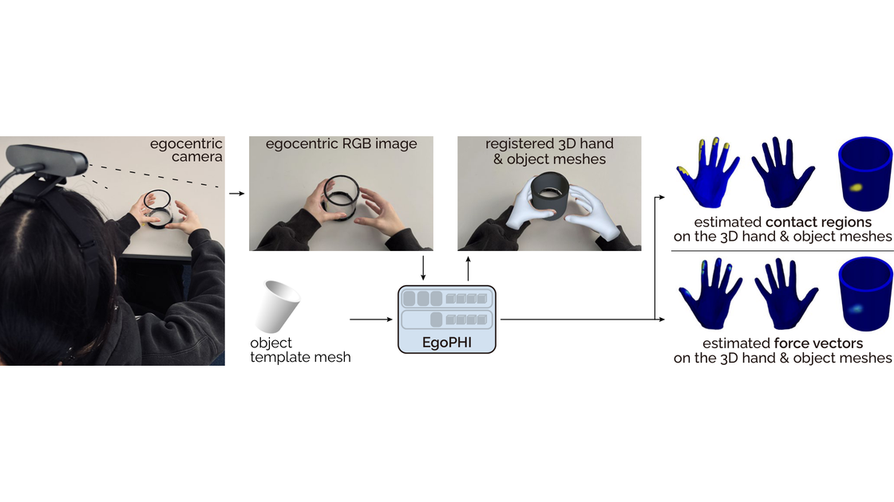
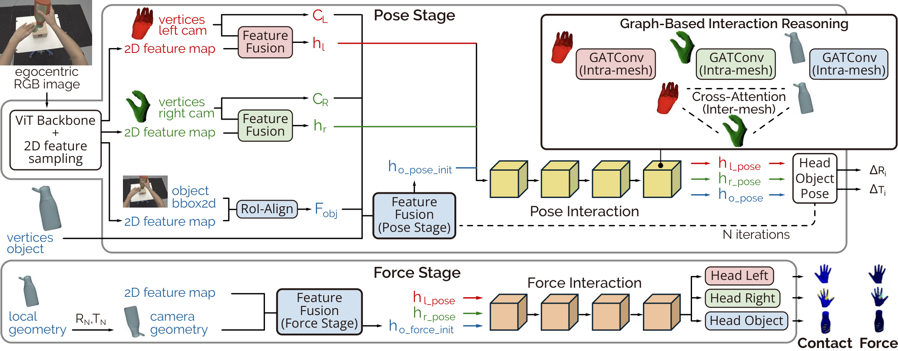

## EgoPHI: Estimating 3D Hand-Object Contact and Force from Egocentric Vision (ECCV 2026)

[Andela Ilic](), [Rachel Schuchert](), [Yijing Jiang](https://www.yijingjiang.com/), [Christian Holz](https://www.christianholz.net)<br/>

[Sensing, Interaction & Perception Lab](https://siplab.org), Department of Computer Science, ETH Zürich, Switzerland <br/>

___________

Our model **EgoPHI** is the first vision-based model that estimates 3D forces and contact during interaction with articulated rigid objects. Given a single egocentric monocular RGB image and the object geometry, EgoPHI registers hand meshes to refine the object pose in a shared camera coordinate frame, and predicts dense per-vertex contact and force distributions over all meshes for physically grounded interaction reasoning.
<div align="center">

</div>


Abstract
----------
Understanding hand-object interaction from egocentric vision is essential for modeling how people physically engage with the surrounding world.
Yet reasoning about physically grounded interaction requires estimating the forces acting on hands and objects, beyond localizing contact.
We present EgoPHI, the first method that jointly estimates dense contact maps and 3D force distributions on hand and object meshes from a single monocular RGB image and object geometry.
To address the lack of scalable ground-truth force annotations, we introduce a physics-based simulation pipeline that augments existing hand-object datasets with dense per-vertex force supervision.
EgoPHI then learns dense 3D contact and force on interacting hand and articulated object meshes, extending vision-based force estimation beyond image-space or planar settings.
Our evaluation on in-distribution and out-of-distribution benchmarks shows that EgoPHI improves force estimation over existing approaches while generalizing to unseen datasets.
To evaluate sim-to-real transfer, we constructed two physical objects that capture dense object contact and force magnitude and used them to record a dataset of interactions from eight participants across diverse touch and grasp types.
Our results demonstrate that EgoPHI recovers meaningful 3D contact and force distributions in simulated, out-of-distribution, and real-world settings, advancing egocentric hand-object understanding from contact localization toward physically grounded interaction reasoning.


Method Overview
----------
EgoPHI's 3-stage pipeline: 
(1) visual & geometric feature extraction with cross-modal fusion, 
(2) object pose estimation, and 
(3) contact and force estimation. 
<p align="center">

</p>

Code
----------

#### Dependencies

1. Create a new conda environment and install pytorch:

   ```bash
   conda env create -f environment.yml python=3.10
   conda activate egophi
   ```

2. Download [ARCTIC](https://github.com/zc-alexfan/arctic/blob/master/docs/data/README.md) dataset.
3. Download [H2O](https://taeinkwon.com/projects/h2o/) dataset.
4. 
5. Download pretrained weights

   
   1. Download pre-trained weights from [here]().

#### Evaluation

To run the evaluation, we first process our test dataset by running:

`python modules/dataset/preprocess.py`

Then, we could run an evaluation of our model by

```bash
python modules/evaluate/evaluator.py --network UIP\
                    --ckpt_path /path/to/model.pt\
                    --data_dir /path/to/preprocessed_dataset\
                    --eval_trans\
                    --normalize_uwb\
                    --flush_cache\
                    --add_guassian_noise\
                    --model_args_file config/model_args.json\
                    --eval_save_dir output/evaluation_res
```

`/path/to/preprocessed_dataset` is the folder that contains the processed  data `test.pt` .

#### Visualization

`python visualizer/visualize_result.py --seq_res_path "data/result/[dataset_name]/[model_name]" --seq_id X`

Dataset
----------
Please download our UIP-DB dataset from [Google Drive]().

Citation
----------
If you find our paper or codes useful, please cite our work:

    @article{
     }


License and Acknowledgement
----------
This project is released under the MIT license.
